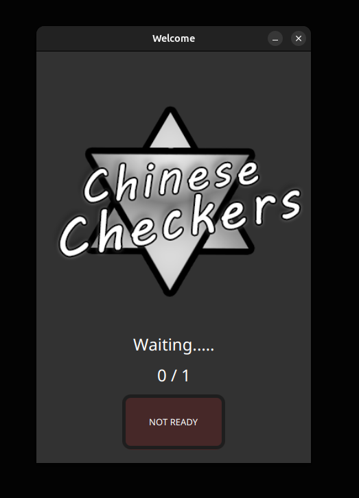
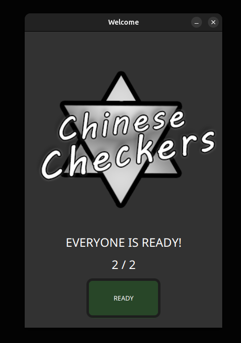
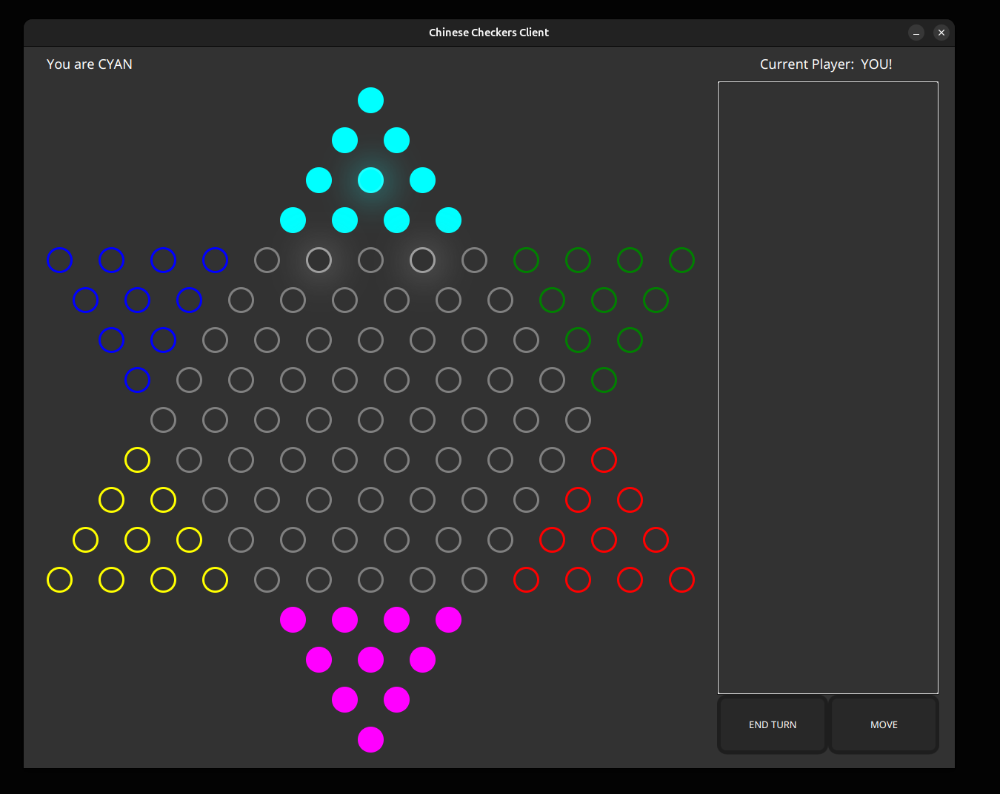
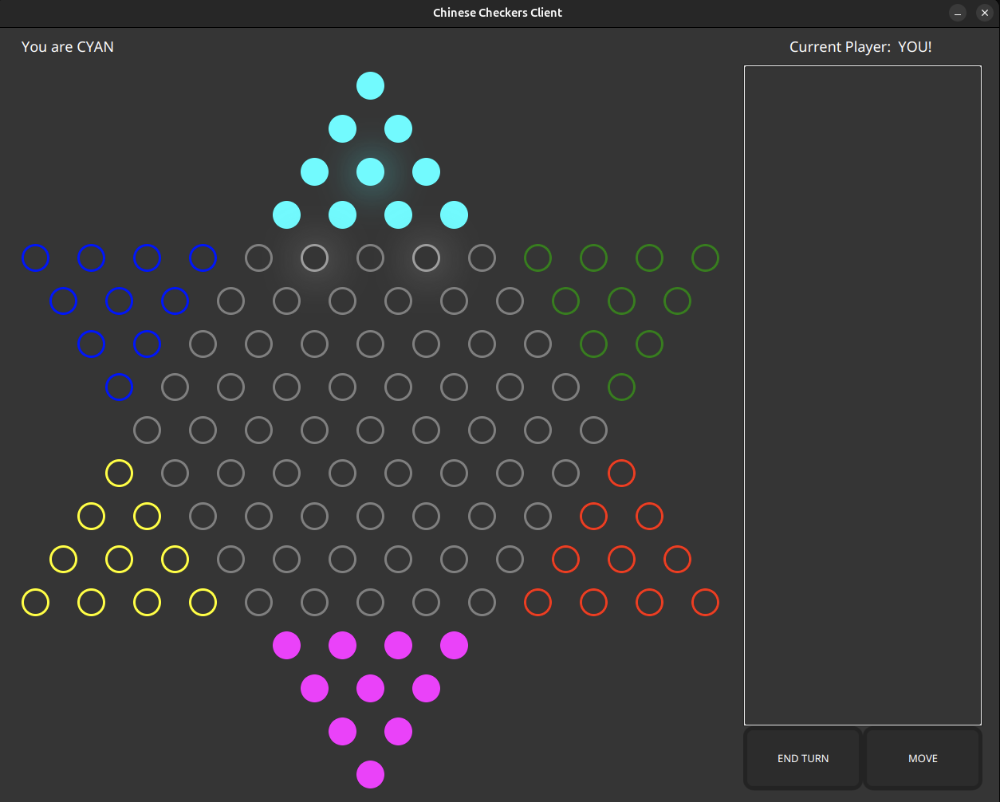
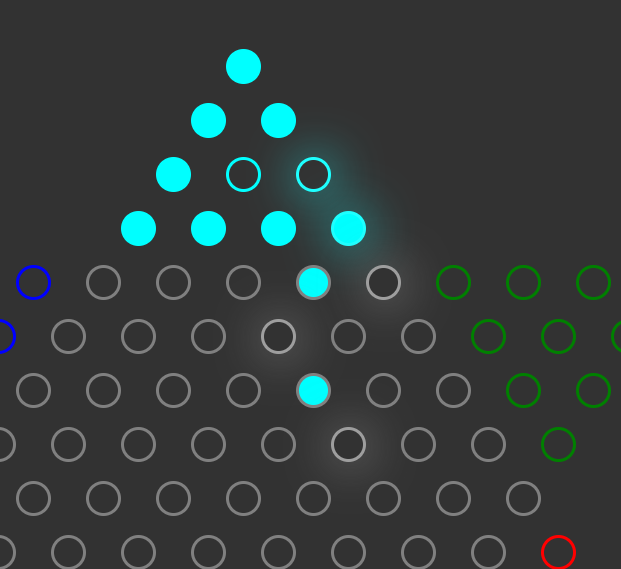

# Chinese Checkers:

*A multi-threaded client–server game with a full GUI, supporting two distinct game modes, local multiplayer or bot play for up to 6 players, and a replay mode with automatic game recording.*

[Download dependencies](https://github.com/ShrikeBin/ChineseCheckers/releases/download/dependencies/lib.zip)
**Unzip in the project root directory to use**

## Screenshots

<p align="center">
  
  
</p>

<p align="center">
  
</p>

<p align="center">
  
  
</p>


## Build and run project
- `make` - build project
- `make runServer` - to run server
    - `make runServer` - to run BASIC variant
    - `make runServer ARGS="OOC"`  - to run Order Out of Chaos variant
    - `make runServer ARGS="TEST"` - to run special test variant
- During server runtime:
    - `ADD_BOT` - adds a bot
- `make runClient` - to run client
    - `make runClientResize` - to run resizable client (compatibility for small displays)
- `make runReplay ARGS="<filepath>"` - to run replay mode

## Project Structure

```
ChineseCheckers/ 
│
├── client/
│   ├── BoardGridPane.java                 # Generates board grid (server uses data/star.json instead)
│   ├── BoardUI.java                       # Visual board wrapper and UI utilities
│   ├── CheckersClientApp.java             # Main client application entry point (GUI launcher)
│   ├── GameRequestMediator.java           # Server listener; updates GUI based on incoming requests
│   ├── GameUiController.java              # Interprets GUI actions and sends requests via mediator
│   ├── GameUI.java                        # Game room UI (active match controls & layout)
│   ├── GraphicNode.java                   # Visual representation of a board node
│   └── WelcomeUI.java                     # Waiting room UI with basic control functionality
├── data/
│   └── ...                                # Images, Logos and default board configuration
├── lib/
│   └── ...                                # External libraries and dependencies     
├── memento/
│   ├── Recorder.java                      # Records moves and game states
│   └── SavedMove.java                     # Immutable snapshot of a single move
├── replay/
│   ├── ListKeyDeserializer.java           # Custom deserializer for replay data
│   ├── RecordReader.java                  # Reads and plays visually saved games
│   └── ReplayApp.java                     # Replay application entry point
├── server/
│   ├── bots/
│   │   └── ClosestMoveBot.java            # Bot choosing the nearest valid move
│   ├── game/
│   │   ├── basic/                         # Default variant
│   │   │   ├── Board.java                 # Concrete board implementation (graph of Nodes)
│   │   │   ├── Builder.java               # Builds board + move checker for basic variant
│   │   │   └── MoveChecker.java           # Validates moves according to basic rules
│   │   ├── ooc/                           # Alternative Order Out of Chaos variant
│   │   │   ├── OOCBoard.java              
│   │   │   └── OOCBuilder.java            
│   │   ├── GameAssetsBuilder.java         # Interface combining Board and MoveChecker (getters)
│   │   ├── GameAssetsFactory.java         # Factory creating game assets for different variants
│   │   ├── Game.java                      # Controls game flow, turns, and win conditions
│   │   ├── IBoard.java                    # Board interface for variant-independent logic
│   │   ├── IMoveChecker.java              # Interface for validating move legality
│   │   ├── Node.java                      # Represents a position on the board graph
│   │   ├── Piece.java                     # Represents a game piece owned by a player
│   │   └── test/                          # Test folder
│   ├── CheckersServer.java                # Main server controller; accepts clients, manages threads
│   ├── ClientHandler.java                 # Per-client communication handler (1:1 thread with client)
│   ├── RequestRunnable.java               # Extended Runnable for request-based execution
│   └── ServerPlayer.java                  # Server-side player model (ID, color, state)
├── shared/                                
│   ├── ColorTranslator.java               # Serializes JavaFX Color
│   ├── GameState.java                     # Current board state, turn, and win condition
│   ├── Move.java                          # Move defined by BeginID and EndID
│   ├── Player.java                        # Player identity and color
│   └── Request.java                       # Generic request wrapper containing Move / Player / GameState
├── utils/
│   ├── Condition.java                     # Boolean wrapper for thread synchronization
│   ├── IntList.java                       # List helper with simplified access and equality
│   ├── IntMap.java                        # Map helper with simplified access and equality
│   └── Pair.java                          # Generic pair utility [DEPRECATED]
├── game_updates.json                      # Serialized game replay (that is the default save name of the game)
├── Makefile                               # Build and run automation
└── README.md                              # Project documentation
```
